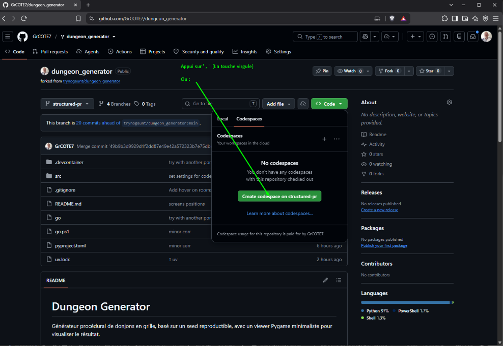
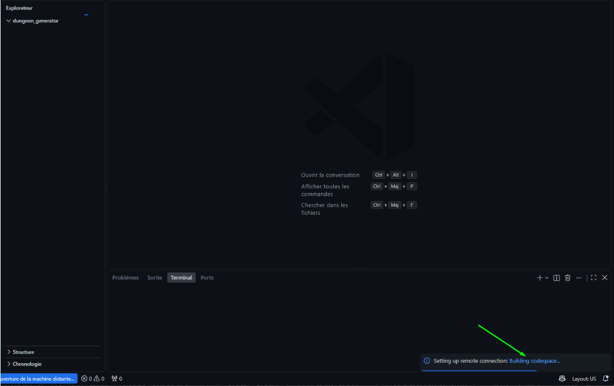
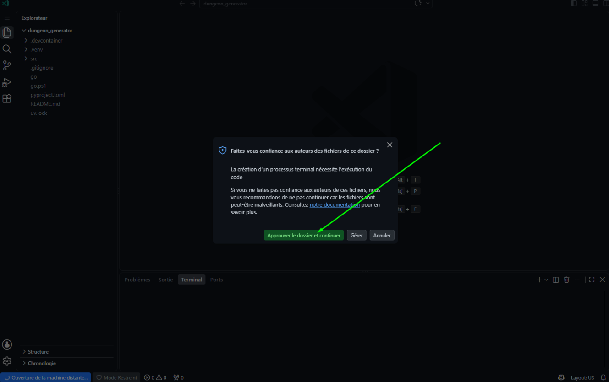
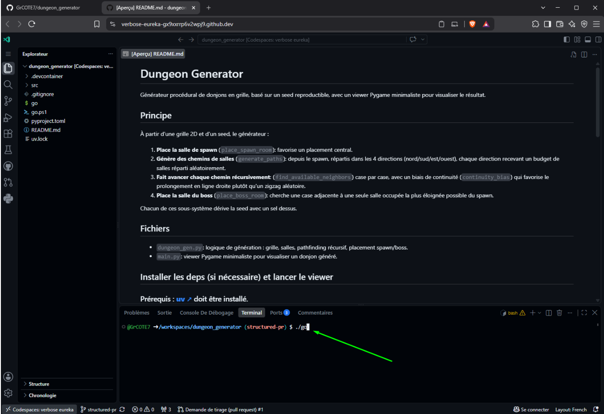
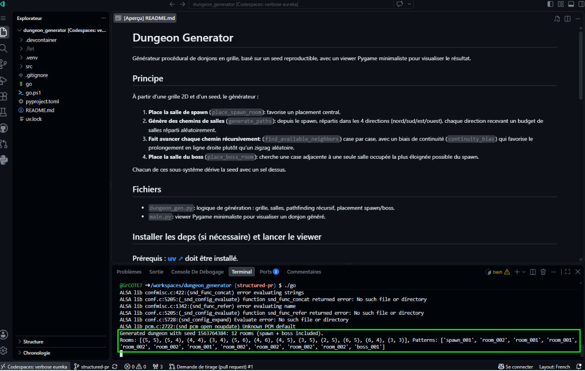
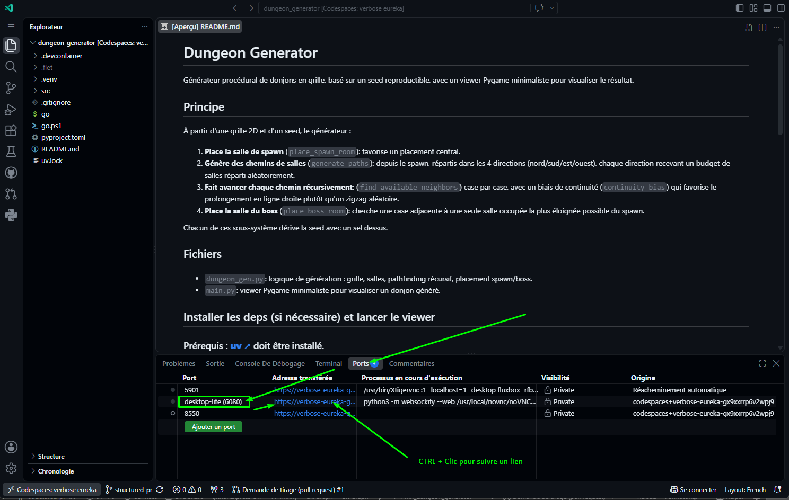
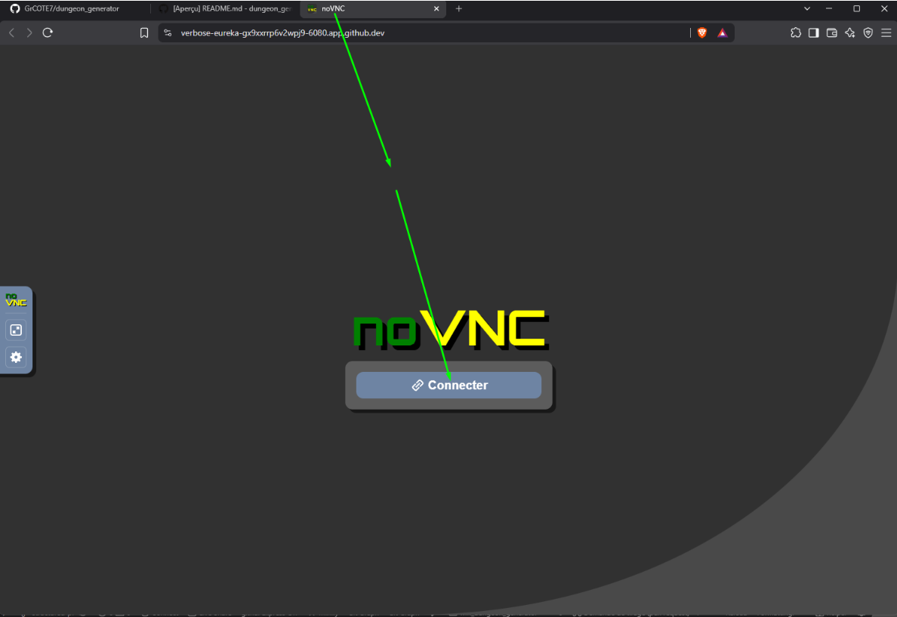
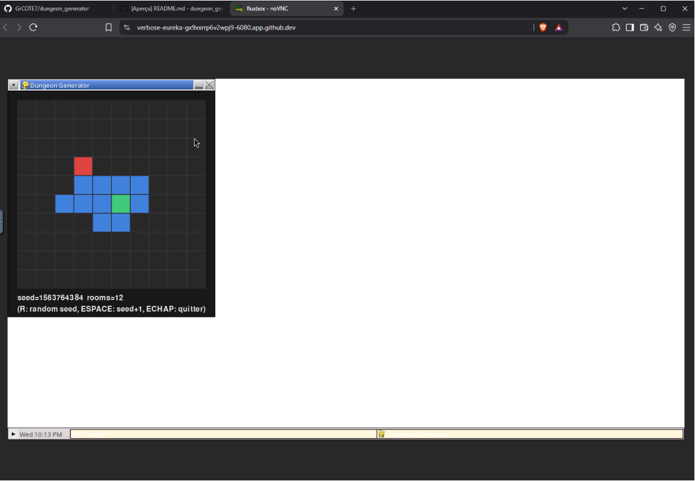
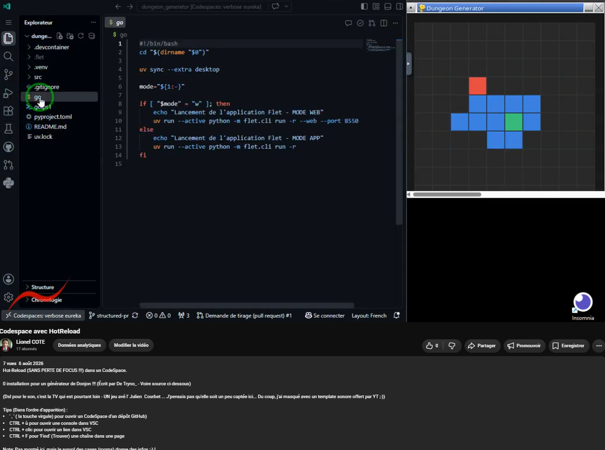

# Usage dans un CodeSpace

Ça peut dépanner et servir :

## 01. Mise en route d'un CodeSpace

  

## 02. Création

Le process mets du temps (1 à 2 minutes) lors de la création initiale, mais ensuite, l'ouverture est instantannée.

  

## 03. Approbation du nouveau dossier

Simple formalité...

  

## 04. Installation des dépendances, librairies, etc...  et lancement du script (point d'entrée)

Une seule courte commande (Linux/MacOS ou Windows) !

  

## 05. Script lancé

  

https://prnt.sc/cT5D7Jt8RWEn

## 06 Fenêtre de l'Application

La CLI (*Commande Line Interface*, bref, la Console), c'est sympa, ça rend pas mal de services... Mais avoir le rendu de notre App serait appréciable aussi, non ;-) ?

  

On l'autorise bien évidemment...

  

Et voilà :-) : Plus qu'à la positionner (Une seule fois pour toute la cession) !

  

Et le + bô : HotReload  OK 😊 (Et le focus reste dans l'éditeur !!!)

Look la ch'ti vidéo (3'36) !

  

